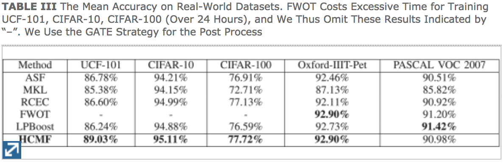

# [Late Fusion via Subspace Search with Consistency Preservation](https://ieeexplore.ieee.org/document/8451915)

We propose an late fusion algorithm, i.e., Hard-rank Constraint Matrix Factorization-based method (HCMF). We experiment on classification tasks, e.g., UCF-101, CIFAR-10, CIFAR-100, OXFORD-IIIT-Pet, PASCAL VOC 2007.


Table 1. The Mean Accuracy on 5 Real-World Datasets.

## Citation
If you find this project help your research, please cite:
```
@article{dong2019hcmf,
  title  = {Late Fusion via Subspace Search with Consistency Preservation},
  author = {Dong, Xuanyi and Yan, Yan and Tan, Mingkui and Yang, Yi and Tsang, Ivor W},
  journal= {IEEE Transactions on Image Processing (TIP)},
  year   = {2019}, 
  volume = {28}, 
  number = {1}, 
  pages  = {518-528},
  doi    = {10.1109/TIP.2018.2867747}, 
  ISSN   = {1057-7149},
  month  = {Jan}
}
```

## Visualization
To generate the figures used in this paper (synthetic experiments), please use the following code:
```
cd codes/visualization/
matlab
warp_vis(250, 15, 20, [0.3], 'results/visual/')
```


## Resourse
- LRGeomCG, Low-rank matrix completion by Riemannian optimization. [\[paper\]](http://www.unige.ch/math/vandereycken/bibtexbrowser.php?key=Vandereycken_2013&bib=my_pubs.bib)[\[code\]](http://www.unige.ch/math/vandereycken/software/RiemannianMatrixCompletion_31Jun2014.zip)
- [Riemannian Pursuit For Big Matrix Recovery](http://www.tanmingkui.com/uploads/2/9/6/5/29654919/rp_to_pub.rar)

