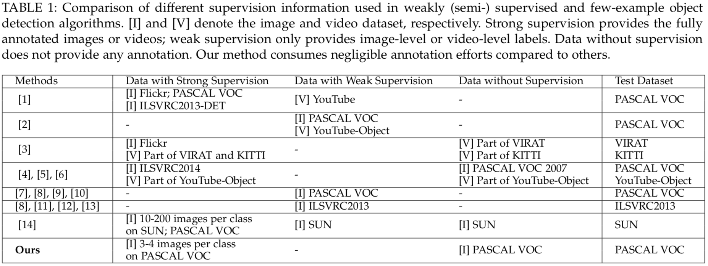

# [Few-Example Object Detection with Model Communication](https://ieeexplore.ieee.org/document/8374906)

By Xuanyi Dong, Liang Zheng, Fan Ma, Yi Yang, Deyu Meng

## Introduction

This project aims to solve the few-example object detection problem, in which there are only a few images with bounding box annotations per object class and a large number of images without annotations.
We propose an algorithm to combine the self-paced learning and the multi-modal learning, and we call it Multi-modal Self-Paced Learning for Detection (MSPLD). The implementation is modified from [R-FCN](https://github.com/daijifeng001/R-FCN) and [Faster RCNN](https://github.com/shaoqingren/faster_rcnn).

**Note that** few-example object detection is a special case of semi-supervised object detection. However, most works on semi-supervised object detection assume that some classes have many strong bounding boxes, while others have weak image-level labels. A brief comparison between MSPLD and weakly supervised/semi-supervised/few-example object detection is shown below:


Please refer to the paper for more detailed comparison.

### Citation

If you find MSPLD useful in your research, please consider citing:
```
@article{dong2018fewexample,
  title   = {Few-Example Object Detection with Model Communication},
  author  = {Dong, Xuanyi and Zheng, Liang and Ma, Fan and Yang, Yi and Meng, Deyu},
  journal = {IEEE Transactions on Pattern Analysis and Machine Intelligence (TPAMI)},
  doi     = {10.1109/TPAMI.2018.2844853}, 
  ISSN    = {0162-8828}, 
  year    = {2018}
}
```

## Experiments

### Requirements: software

- `Caffe` build for MSPLD (included in this repository, see `external/caffe`)
- MATLAB 2014a or later

### Data Preparation
- Download PASCAL VOC 2007 and PASCAL VOC 2012. Follow the `README` in `datasets`
- Download the region proposals extracted by Selective Search or EdgeBox. 
- Download the pre-trained Imagenet models for ResNet, VGG, and GoogleNet
 
### Training & Testing
0. Run `experiments/VOC07_Tr_Res50E_Res101S_VGG16F` to repoduce the results on VOC 2007.

### Resources
0. Selective Search Data: [Google Drive](https://drive.google.com/open?id=1o6RPL33bH0u75Z-gknu1ewKGQHTmmtwC)
1. YFCC100M Data for Ablative Study: [Google Drive](https://drive.google.com/open?id=1o6RPL33bH0u75Z-gknu1ewKGQHTmmtwC)
0. Detection models are in the `models` directory.
